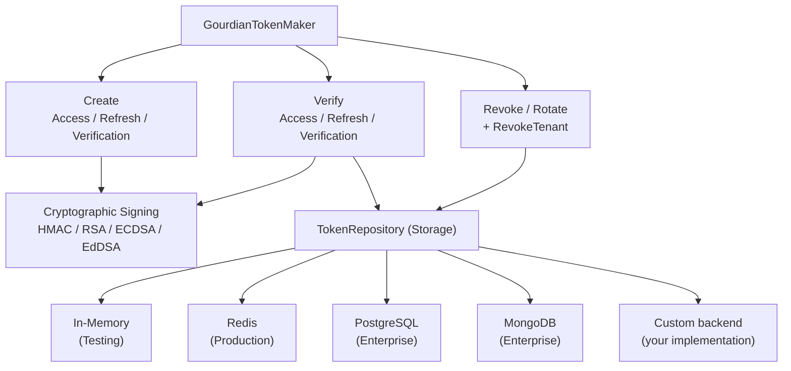
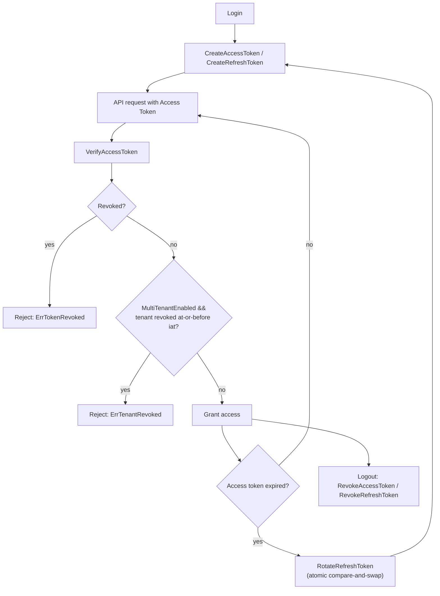
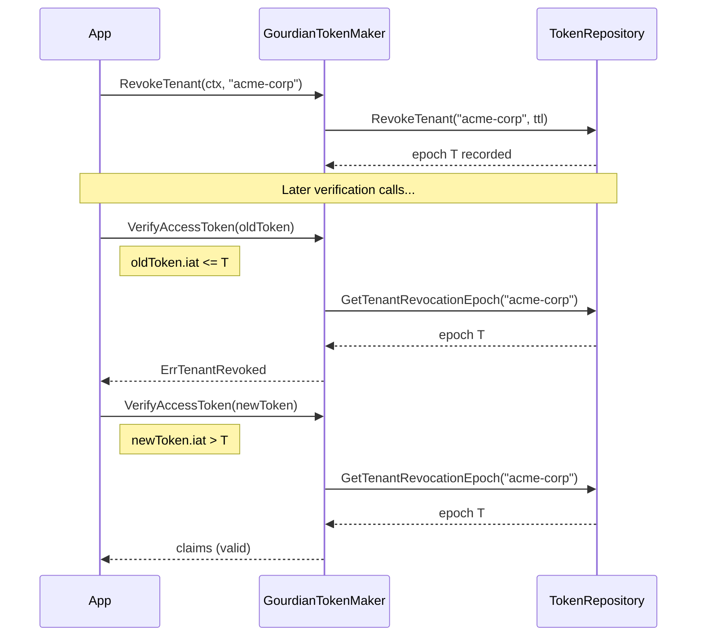

# Gourdiantoken – Enterprise-Grade JWT Management for Go


[](LICENSE)
[](https://pkg.go.dev/github.com/gourdian25/gourdiantoken/v2)

**gourdiantoken** is a production-ready, comprehensive JWT token management system designed for modern Go applications. Built with security-first principles and performance optimization, it provides everything needed for enterprise authentication systems — from basic token generation to advanced features like automatic rotation, Redis-backed revocation, and multi-algorithm cryptographic support.

## 🌐 Part of the gourdian25 ecosystem

gourdiantoken is one of several small, independent Go libraries meant to be
used together:

- [grlog](https://github.com/gourdian25/grlog) — zero-dependency structured
  logging.
- [grcache](https://github.com/gourdian25/grcache) — backend-agnostic
  caching abstraction, the same architectural pattern (interface + pluggable
  backends) gourdiantoken uses for its `TokenRepository`.
- [grevents](https://github.com/gourdian25/grevents) — an in-process event
  bus for decoupling producers of state changes from consumers that react
  to them.
- [graudit](https://github.com/gourdian25/graudit) — an append-only,
  tamper-evident audit log with pluggable storage backends.
- [grpolicy](https://github.com/gourdian25/grpolicy) — attribute-based
  policy evaluation (RBAC/ABAC), independent of any notion of "user" or
  "role".
- [grnoti](https://github.com/gourdian25/grnoti) — a push-notification
  service handling FCM dispatch, idempotent event processing, device-token
  management, DLQ retry, circuit breaking, distributed rate limiting,
  deterministic A/B experiment assignment, localization, and topic-based
  routing.

## 🎯 Why Gourdiantoken?

- 🔐 **Complete Security**: Token rotation, revocation, replay attack prevention, and strict claim validation
- ⚡ **High Performance**: Up to 200k operations/second with optimized algorithms
- 🔧 **Flexible Storage**: In-memory, Redis, PostgreSQL, MongoDB — choose what fits your architecture
- 🧩 **Algorithm Support**: HMAC (HS256/384/512), RSA (RS256/384/512, PS256/384/512), ECDSA (ES256/384/512), EdDSA
- 🛡️ **Production Ready**: Thread-safe, context-aware, automatic cleanup, comprehensive error handling
- 📊 **Battle Tested**: Extensive test coverage with real-world scenarios and edge cases

---

## 📚 Table of Contents

- [Features](#-features)
- [Installation](#-installation)
- [Migrating from v1.x](#-migrating-from-v1x)
- [Quick Start](#-quick-start)
- [Architecture Overview](#-architecture-overview)
- [Configuration](#-configuration)
- [Storage Backends](#-storage-backends)
- [Token Types & Claims](#-token-types--claims)
- [Security Features](#-security-features)
- [Multi-Tenancy](#-multi-tenancy)
- [Thread Safety](#-thread-safety)
- [API Reference](#-api-reference)
- [Advanced Usage](#-advanced-usage)
- [Performance](#-performance)
- [Best Practices](#-best-practices)
- [Examples](#-examples)
- [Testing](#-testing)
- [Contributing](#-contributing)
- [License](#-license)

---

## 🚀 Features

### Core Token Management

- **Dual Token System**: Short-lived access tokens (15-60 min) with long-lived refresh tokens (7-90 days)
- **Comprehensive Claims**: Opaque string identifiers for users/sessions, username, roles (RBAC), issuer, audience, timestamps
- **Flexible Expiration**: Configure both sliding expiration and absolute maximum lifetime
- **Context-Aware**: All operations support Go context for cancellation and timeouts

### Advanced Security

- **Token Rotation**: Automatic refresh token rotation with replay attack detection
- **Token Revocation**: Immediately invalidate tokens before natural expiration
- **Algorithm Flexibility**: Support for 11 different JWT signing algorithms
- **Strict Validation**: Comprehensive signature, expiration, claim, and type checking
- **Secure Defaults**: Pre-configured with industry best practices

### Storage & Scalability

- **Multiple Backends**: In-memory, Redis, PostgreSQL (pgx/v5, no ORM), MongoDB
- **Automatic Cleanup**: Background goroutines remove expired entries
- **Atomic Operations**: Race-condition-free rotation with compare-and-swap semantics
- **Production Scale**: Designed for distributed systems and high-throughput APIs

### Developer Experience

- **Clean API**: Intuitive interface with clear method signatures
- **Factory Methods**: Quick setup with defaults or full customization
- **Rich Documentation**: Comprehensive inline documentation and examples
- **Type Safety**: Strong typing with time.Time throughout; user/session identifiers are plain strings (any non-empty value, not restricted to UUID format)

---

## 📦 Installation

```bash
go get github.com/gourdian25/gourdiantoken/v2@latest
```

**Requirements**: Go 1.26.4 or higher (ecosystem-aligned minimum)

**Optional Dependencies** (based on storage backend):

```bash
# For Redis support
go get github.com/redis/go-redis/v9

# For PostgreSQL
go get github.com/jackc/pgx/v5

# For MongoDB
go get go.mongodb.org/mongo-driver
```

---

## ⬆️ Migrating from v1.x

**v2.0.0 is a breaking release**: `ID`/`Subject`/`SessionID` on `AccessTokenClaims`/`RefreshTokenClaims`, and `Subject`/`SessionID` on `AccessTokenResponse`/`RefreshTokenResponse`, changed from `uuid.UUID` to plain `string`. Likewise, the `userID`/`sessionID` parameters on `CreateAccessToken`/`CreateRefreshToken` are now `string` instead of `uuid.UUID`. Any non-empty string is now accepted — values no longer need to be UUID-shaped. If you were calling `.String()` on these fields, drop that call; they're already strings. See [CHANGELOG.md](./CHANGELOG.md) for the full list of changes, including several non-breaking fixes bundled into this release. Since `google/uuid` is now only used internally (for the token ID / `jti`), v2 consumers who only pass their own string identifiers no longer need to import it themselves at all — it remains a direct dependency of this module only for that internal use.

## ⚠️ Upgrading to v2.2.0 (GORM removed, storage names changed)

**v2.2.0 contains breaking changes despite the minor-looking version bump** — the module path stays `/v2` by choice (see below), but the changes are not backward compatible:

1. **GORM is gone.** `GormTokenRepository` and `NewGourdianTokenMakerWithGorm` no longer exist. Replace them with `PostgresTokenRepository` / `NewGourdianTokenMakerWithPostgres`, which take a `*pgxpool.Pool` you build and own yourself instead of a `*gorm.DB`:

   ```go
   // Before (v2.1.x)
   db, _ := gorm.Open(postgres.Open(dsn), &gorm.Config{})
   maker, err := gourdiantoken.NewGourdianTokenMakerWithGorm(ctx, config, db)

   // After (v2.2.0+)
   pool, _ := pgxpool.New(ctx, dsn)
   defer pool.Close()
   maker, err := gourdiantoken.NewGourdianTokenMakerWithPostgres(ctx, config, pool)
   ```

   (As of v2.4.0, this also requires `gourdiantoken.PostgresSchemaSQL()` to already be applied via your own migration tool first — see [Upgrading to v2.4.0](#️-upgrading-to-v240) below.)

2. **Storage names changed to a `gourdiantoken`-prefixed convention**, matching the rest of the gourdian25 ecosystem:

   | Storage | Old name | New name |
   |---|---|---|
   | Postgres tables | `revoked_tokens`, `rotated_tokens` | `gourdiantoken_revoked_tokens`, `gourdiantoken_rotated_tokens` |
   | Mongo collections | `revoked_tokens`, `rotated_tokens` | `gourdiantoken_revoked_tokens`, `gourdiantoken_rotated_tokens` |
   | Redis key prefixes | `revoked:access:`, `revoked:refresh:`, `revoked:verification:`, `rotated:` | `gourdiantoken:revoked:access:`, `gourdiantoken:revoked:refresh:`, `gourdiantoken:revoked:verification:`, `gourdiantoken:rotated:` |

   **This is a new location, not an in-place rename.** Any revoked or rotated tokens recorded under the old names will not be visible after upgrading — previously-revoked tokens could appear valid again until they're revoked a second time or naturally expire. Before deploying this upgrade to a system with real users:
   - Either migrate existing rows/documents/keys to the new names yourself (a straightforward `INSERT INTO gourdiantoken_revoked_tokens SELECT * FROM revoked_tokens` for Postgres, an equivalent copy for Mongo/Redis), **or**
   - Accept a one-time revocation-state reset (safe only if you can tolerate previously-revoked tokens being accepted again for the remainder of their natural expiry).

3. **Why the module path didn't change to `/v3`**: Go's own tooling requires a `/v3` import path for a real `v3.0.0` tag, which would force every consumer to update their import statements. Since this library has few external consumers today, that churn wasn't worth it — this release intentionally does not follow strict semver (a breaking change shipped as a `v2.x.y` bump). If that changes and broad compatibility guarantees become necessary, a future breaking release will move to `/v3` properly.

## ⚠️ Upgrading to v2.3.0

**v2.3.0 contains breaking changes**, same rationale as v2.2.0 above for staying on the `/v2` module path.

1. **`PrivateKeyPath`/`PublicKeyPath` (file paths) are gone, replaced by `PrivateKeyPEM`/`PublicKeyPEM` (`[]byte`).** `GourdianTokenConfig` no longer reads a key off disk itself — asymmetric signing now takes PEM-encoded key bytes directly, sourced however your own deployment already handles secrets (an env var, a Kubernetes `Secret` mounted as a volume or injected as env vars, the External Secrets Operator, Vault Agent Injector, the CSI Secret Store driver, or a direct secret-manager SDK call). This removes the assumption that every consumer distributes keys as files on disk:

   ```go
   // Before (v2.2.x)
   config := gourdiantoken.GourdianTokenConfig{
       SigningMethod:  gourdiantoken.Asymmetric,
       Algorithm:      "RS256",
       PrivateKeyPath: "/keys/private.pem",
       PublicKeyPath:  "/keys/public.pem",
       // ...
   }

   // After (v2.3.0+) — read the bytes however fits your deployment, once at startup
   privateKeyPEM, _ := os.ReadFile("/var/run/secrets/gourdiantoken/private.pem")
   publicKeyPEM, _ := os.ReadFile("/var/run/secrets/gourdiantoken/public.pem")

   config := gourdiantoken.GourdianTokenConfig{
       SigningMethod: gourdiantoken.Asymmetric,
       Algorithm:     "RS256",
       PrivateKeyPEM: privateKeyPEM,
       PublicKeyPEM:  publicKeyPEM,
       // ...
   }
   ```

   `NewGourdianTokenConfig`'s deprecated positional constructor changed to match: its `privateKeyPath, publicKeyPath string` parameters are now `privateKeyPEM, publicKeyPEM []byte`, same argument positions (9th/10th).

2. **`CreateAccessToken`/`CreateRefreshToken` gain a new, required trailing `tenantID string` parameter.** This is the change that breaks *every* existing call site, regardless of whether you use multi-tenancy — **pass `""` if you don't**:

   ```go
   // Before (v2.2.x)
   token, err := maker.CreateAccessToken(ctx, userID, username, roles, sessionID)
   refresh, err := maker.CreateRefreshToken(ctx, userID, username, sessionID)

   // After (v2.3.0+) — pass "" to keep existing single-tenant behavior
   token, err := maker.CreateAccessToken(ctx, userID, username, roles, sessionID, "")
   refresh, err := maker.CreateRefreshToken(ctx, userID, username, sessionID, "")
   ```

   Set `GourdianTokenConfig.MultiTenantEnabled = true` to opt in instead, in which case `tenantID` becomes required (non-empty) rather than forbidden. See [Multi-Tenancy](#-multi-tenancy) for the full feature, including the new `RevokeTenant` bulk-revocation method and its four new sentinel errors (`ErrTenantIDRequired`, `ErrTenantIDNotAllowed`, `ErrMultiTenantDisabled`, `ErrTenantRevoked`).

3. **The split `GourdianTokenMakerCloser`/`GourdianTokenMakerVerification` interfaces are gone**, merged back into a single flat `GourdianTokenMaker` (which now also gains `RevokeTenant`). If you were doing a type assertion to reach `Close`/`CreateVerificationToken`/`VerifyVerificationToken`/`MarkVerificationTokenUsed`, drop it — every constructor's return value already satisfies the merged interface:

   ```go
   // Before (v2.1.x/v2.2.x)
   closer, ok := maker.(gourdiantoken.GourdianTokenMakerCloser)
   verifier, ok := maker.(gourdiantoken.GourdianTokenMakerVerification)
   token, err := verifier.CreateVerificationToken(ctx, userID, useCase, ttl, metadata)

   // After (v2.3.0+) — call directly, no assertion
   token, err := maker.CreateVerificationToken(ctx, userID, useCase, ttl, metadata)
   ```

4. **`NewGourdianTokenMakerWithMongo` drops its `transactionsEnabled bool` parameter**, now matching the `(ctx, config, handle, opts...)` shape shared by the other three backend factories. Transactions are always enabled (hardcoded `true` internally):

   ```go
   // Before (v2.2.x)
   maker, err := gourdiantoken.NewGourdianTokenMakerWithMongo(ctx, config, mongoDB, true)

   // After (v2.3.0+)
   maker, err := gourdiantoken.NewGourdianTokenMakerWithMongo(ctx, config, mongoDB)
   ```

   If you need transactions disabled (e.g. a standalone dev MongoDB without a replica set), construct the repository yourself instead of using this factory: `repo, _ := gourdiantoken.NewMongoTokenRepository(mongoDB, false)` followed by `gourdiantoken.NewGourdianTokenMaker(ctx, config, repo)`.

5. **`TokenRepository` gains `Stats`/`CleanupAll`; every backend's `Close()` is now a bare, no-argument method.** `Stats(ctx) (map[string]interface{}, error)` and `CleanupAll(ctx) error` are now part of the `TokenRepository` interface itself (previously Postgres-only extensions reached via a type assertion) and share identical key names/behavior across all four backends. `MongoTokenRepository.Close(ctx context.Context) error` lost its (always-unused) context parameter, so it now matches `Close() error` on the other three backends:

   ```go
   // Before (v2.2.x)
   pgRepo := repo.(*gourdiantoken.PostgresTokenRepository) // only Postgres had Stats/CleanupAll
   stats, err := pgRepo.Stats(ctx)
   err = mongoRepo.Close(ctx)

   // After (v2.3.0+)
   stats, err := repo.Stats(ctx) // works on the TokenRepository interface directly, any backend
   err = repo.CleanupAll(ctx)
   err = mongoRepo.Close() // no argument
   ```

   `MarkTokenRotatedAtomic` also became consistent across all four backends in this release: Postgres and MongoDB previously treated *any* existing rotation record as a conflict, even an already-expired one (Memory/Redis always allowed re-marking an expired entry); all four now agree.

## ⚠️ Upgrading to v2.4.0

**v2.4.0 is breaking, for the Postgres backend only.** Neither `NewPostgresTokenRepository` nor `NewGourdianTokenMakerWithPostgres` applies schema at construction time anymore — signatures are unchanged, but you now need to apply the schema yourself, once, before calling either:

```go
// Before (v2.3.x) — schema applied automatically on every connect
pool, _ := pgxpool.New(ctx, dsn)
maker, err := gourdiantoken.NewGourdianTokenMakerWithPostgres(ctx, config, pool)

// After (v2.4.0+) — apply gourdiantoken.PostgresSchemaSQL() through your own
// migration tool first (golang-migrate, Flyway, a plain SQL file in CI, ...),
// then construct exactly as before
pool, _ := pgxpool.New(ctx, dsn)
maker, err := gourdiantoken.NewGourdianTokenMakerWithPostgres(ctx, config, pool)
```

Why: the old auto-apply required the pool's connection role to have `CREATE` on the target schema, which a deliberately least-privilege application role (a common production setup — a separate role owns migrations, the app connects with a DML-only role) doesn't have — it failed loudly with `permission denied for schema ...`, and pre-creating the tables some other way didn't help either, since `CREATE TABLE IF NOT EXISTS` still checks `CREATE` privilege before checking whether the table exists. Rather than add a flag to opt out of auto-apply on a per-call basis, gourdiantoken now simply never does it — see [docs/postgres.md](docs/postgres.md) for the full pattern and rationale.

If your Postgres role already had `CREATE` (the common case for a dev database or a single-role deployment), nothing about your setup breaks except the timing: apply `PostgresSchemaSQL()` once via any method (even a one-off `psql -f` piping its output) before your application first connects, and everything else works exactly as before.

---

## 🚀 Quick Start

### Basic HMAC Setup (No Storage)

Perfect for getting started, development, or stateless microservices:

```go
package main

import (
    "context"
    "fmt"
    "log"
    "time"

    "github.com/gourdian25/gourdiantoken/v2"
    "github.com/google/uuid"
)

func main() {
    ctx := context.Background()

    // 1. Create configuration with secure key (min 32 bytes)
    config := gourdiantoken.DefaultGourdianTokenConfig(
        "your-secret-key-at-least-32-bytes-long",
    )

    // 2. Create token maker (nil = no storage backend)
    maker, err := gourdiantoken.NewGourdianTokenMakerNoStorage(ctx, config)
    if err != nil {
        log.Fatal(err)
    }

    // 3. Create access token
    userID := uuid.NewString()
    sessionID := uuid.NewString()
    
    accessToken, err := maker.CreateAccessToken(
        ctx,
        userID,
        "john.doe@example.com",
        []string{"user", "admin"},
        sessionID,
        "", // tenantID: only required when MultiTenantEnabled is true
    )
    if err != nil {
        log.Fatal(err)
    }

    fmt.Printf("Access Token: %s\n", accessToken.Token)
    fmt.Printf("Expires: %s\n", accessToken.ExpiresAt.Format(time.RFC3339))

    // 4. Verify token
    claims, err := maker.VerifyAccessToken(ctx, accessToken.Token)
    if err != nil {
        log.Fatal(err)
    }

    fmt.Printf("User: %s (ID: %s)\n", claims.Username, claims.Subject)
    fmt.Printf("Roles: %v\n", claims.Roles)
    fmt.Printf("Session: %s\n", claims.SessionID)
}
```

### Production Setup with Redis

For production systems with token rotation and revocation:

```go
package main

import (
    "context"
    "log"
    "time"

    "github.com/gourdian25/gourdiantoken/v2"
    "github.com/google/uuid"
    "github.com/redis/go-redis/v9"
)

func main() {
    ctx := context.Background()

    // 1. Configure Redis
    redisClient := redis.NewClient(&redis.Options{
        Addr:     "localhost:6379",
        Password: "",
        DB:       0,
        PoolSize: 100,
    })

    // 2. Create configuration
    config := gourdiantoken.GourdianTokenConfig{
        SigningMethod:            gourdiantoken.Symmetric,
        Algorithm:                "HS256",
        SymmetricKey:             "your-production-secret-key-32-bytes",
        Issuer:                   "auth.myapp.com",
        Audience:                 []string{"api.myapp.com", "admin.myapp.com"},
        AllowedAlgorithms:        []string{"HS256", "HS384", "HS512"},
        RequiredClaims:           []string{"iss", "aud", "nbf", "mle"},
        RevocationEnabled:        true,
        RotationEnabled:          true,
        AccessExpiryDuration:     15 * time.Minute,
        AccessMaxLifetimeExpiry:  24 * time.Hour,
        RefreshExpiryDuration:    7 * 24 * time.Hour,
        RefreshMaxLifetimeExpiry: 30 * 24 * time.Hour,
        RefreshReuseInterval:     5 * time.Minute,
        CleanupInterval:          6 * time.Hour,
    }

    // 3. Create token maker with Redis
    maker, err := gourdiantoken.NewGourdianTokenMakerWithRedis(ctx, config, redisClient)
    if err != nil {
        log.Fatal(err)
    }

    userID := uuid.NewString()
    sessionID := uuid.NewString()

    // 4. Create token pair
    accessToken, _ := maker.CreateAccessToken(ctx, userID, "alice", []string{"user"}, sessionID, "")
    refreshToken, _ := maker.CreateRefreshToken(ctx, userID, "alice", sessionID, "")

    // 5. Rotate refresh token (old token becomes invalid)
    newRefreshToken, err := maker.RotateRefreshToken(ctx, refreshToken.Token)
    if err != nil {
        log.Printf("Rotation failed: %v", err)
    }

    // 6. Revoke on logout
    maker.RevokeAccessToken(ctx, accessToken.Token)
    maker.RevokeRefreshToken(ctx, newRefreshToken.Token)
}
```

---

## 🏗️ Architecture Overview

### Core Components



### Token Lifecycle



---

## ⚙️ Configuration

### Configuration Structure

```go
type GourdianTokenConfig struct {
    // Security Features
    RotationEnabled          bool          // Enable refresh token rotation
    RevocationEnabled        bool          // Enable token revocation
    
    // Cryptography
    SigningMethod            SigningMethod // Symmetric or Asymmetric
    Algorithm                string        // HS256, RS256, ES256, EdDSA, etc.
    SymmetricKey             string        // For HMAC (min 32 bytes)
    PrivateKeyPEM            []byte        // PEM bytes, for RSA/ECDSA/EdDSA
    PublicKeyPEM             []byte        // PEM bytes, for RSA/ECDSA/EdDSA
    
    // JWT Claims
    Issuer                   string        // Token issuer (iss)
    Audience                 []string      // Intended recipients (aud)
    AllowedAlgorithms        []string      // Algorithm whitelist
    RequiredClaims           []string      // Mandatory claims
    
    // Token Lifetimes
    AccessExpiryDuration     time.Duration // Access token lifetime
    AccessMaxLifetimeExpiry  time.Duration // Absolute max for access
    RefreshExpiryDuration    time.Duration // Refresh token lifetime
    RefreshMaxLifetimeExpiry time.Duration // Absolute max for refresh
    RefreshReuseInterval     time.Duration // Min time between reuse
    
    // Maintenance
    CleanupInterval          time.Duration // Cleanup frequency
    
    // Verification Tokens (optional; see "Verification Tokens" below)
    VerificationTokensEnabled         bool          // Master switch
    VerificationAllowedUseCases       []string      // Use-case whitelist
    VerificationDefaultExpiryDuration time.Duration // Used when ttl <= 0
    VerificationMaxExpiryDuration     time.Duration // Ceiling on caller-supplied ttl

    // Multi-Tenancy (optional; see "Multi-Tenancy" below)
    MultiTenantEnabled bool // Requires/forbids tenantID on Create*/Verify*
}
```

### Configuration Field Reference

All ~22 fields of `GourdianTokenConfig`, what they control, their default under
`DefaultGourdianTokenConfig`, and — since `NewGourdianTokenConfig`'s fixed
positional-argument list is a common source of mistakes — exactly which
argument position each one maps to.

| Field | Type | Purpose | Default (`DefaultGourdianTokenConfig`) | `NewGourdianTokenConfig` arg # |
|---|---|---|---|---|
| `SigningMethod` | `SigningMethod` | `Symmetric` (HMAC) or `Asymmetric` (RSA/ECDSA/EdDSA) | `Symmetric` | 1 |
| `RotationEnabled` | `bool` | Enforce single-use refresh token rotation | `false` | 2 |
| `RevocationEnabled` | `bool` | Allow explicit revocation before expiry | `false` | 3 |
| `Audience` | `[]string` | Values written to / checked against the `aud` claim | `nil` | 4 |
| `AllowedAlgorithms` | `[]string` | Verification-time algorithm whitelist | `["HS256","HS384","HS512","RS256","ES256","PS256"]` | 5 |
| `RequiredClaims` | `[]string` | Claims that must be present on every token | `["iss","aud","nbf","mle"]` | 6 |
| `Algorithm` | `string` | JWT signing algorithm (must match `SigningMethod`) | `"HS256"` | 7 |
| `SymmetricKey` | `string` | HMAC secret; must be ≥ 32 bytes | caller-supplied | 8 |
| `PrivateKeyPEM` | `[]byte` | PEM-encoded private key bytes (asymmetric only) | `nil` | 9 |
| `PublicKeyPEM` | `[]byte` | PEM-encoded public key bytes (asymmetric only) | `nil` | 10 |
| `Issuer` | `string` | Value written to / checked against the `iss` claim | `"gourdian.com"` | 11 |
| `AccessExpiryDuration` | `time.Duration` | Access token sliding lifetime | `30m` | 12 |
| `AccessMaxLifetimeExpiry` | `time.Duration` | Absolute ceiling for access tokens (`mle` claim) | `24h` | 13 |
| `RefreshExpiryDuration` | `time.Duration` | Refresh token sliding lifetime | `7d` | 14 |
| `RefreshMaxLifetimeExpiry` | `time.Duration` | Absolute ceiling for refresh tokens (`mle` claim) | `30d` | 15 |
| `RefreshReuseInterval` | `time.Duration` | Minimum gap between reuse attempts (`0` disables) | `5m` | 16 |
| `CleanupInterval` | `time.Duration` | How often background goroutines purge expired entries | `6h` | 17 |
| `VerificationTokensEnabled` | `bool` | Master switch for `CreateVerificationToken`/`VerifyVerificationToken`/`MarkVerificationTokenUsed` | `false` | not settable — assign the field directly |
| `VerificationAllowedUseCases` | `[]string` | Whitelist of acceptable `useCase` strings; empty = any non-empty value | `nil` | not settable — assign the field directly |
| `VerificationDefaultExpiryDuration` | `time.Duration` | Lifetime used when `CreateVerificationToken`'s `ttl` is `<= 0` | `0` (must set if enabling) | not settable — assign the field directly |
| `VerificationMaxExpiryDuration` | `time.Duration` | Ceiling a caller-supplied `ttl` may not exceed; `0` = no ceiling | `0` | not settable — assign the field directly |
| `MultiTenantEnabled` | `bool` | Requires a non-empty `tenantID` on `CreateAccessToken`/`CreateRefreshToken` (and on verify) when `true`; forbids one (must be `""`) when `false` | `false` | not settable — assign the field directly |

The `Verification*` fields and `MultiTenantEnabled` all postdate
`NewGourdianTokenConfig` and are not among its parameters at all — set them
via struct-field assignment after construction regardless of which
constructor you used, e.g. `config.VerificationTokensEnabled = true` or
`config.MultiTenantEnabled = true`.

### Factory Methods

#### 1. DefaultGourdianTokenConfig (Quick Start)

```go
config := gourdiantoken.DefaultGourdianTokenConfig("your-secret-key")
```

**Defaults:**

- Algorithm: HS256
- Access Token: 30 minutes (max 24 hours)
- Refresh Token: 7 days (max 30 days)
- Rotation/Revocation: Disabled
- Issuer: "gourdian.com"

#### 2. NewGourdianTokenConfig (Full Control)

> **Deprecated.** `NewGourdianTokenConfig` will be removed in a future major
> version. Its fixed 17-argument positional list predates the `Verification*`
> fields and `MultiTenantEnabled` (none of which it can set at all — see the
> table above) and is easy to get wrong by position. Prefer `DefaultGourdianTokenConfig` plus
> struct-field assignment, or a bare `gourdiantoken.GourdianTokenConfig{...}`
> literal. It's documented here only because a lot of existing call sites
> use it and the positional table above is the fastest way to read them.

```go
// privateKeyPEM/publicKeyPEM: PEM bytes from wherever your own config system
// holds them — an env var, a mounted Kubernetes Secret read once at
// startup, a secret-manager SDK call. gourdiantoken never reads a key file
// itself.
config := gourdiantoken.NewGourdianTokenConfig(
    gourdiantoken.Asymmetric,           // Signing method
    true,                                // Rotation enabled
    true,                                // Revocation enabled
    []string{"api.example.com"},         // Audience
    []string{"RS256", "ES256"},          // Allowed algorithms
    []string{"iss", "aud", "nbf", "mle"},// Required claims
    "RS256",                             // Algorithm
    "",                                  // Symmetric key (empty for asymmetric)
    privateKeyPEM,                       // Private key PEM bytes
    publicKeyPEM,                        // Public key PEM bytes
    "auth.example.com",                  // Issuer
    15*time.Minute,                      // Access expiry
    24*time.Hour,                        // Access max lifetime
    7*24*time.Hour,                      // Refresh expiry
    30*24*time.Hour,                     // Refresh max lifetime
    5*time.Minute,                       // Reuse interval
    6*time.Hour,                         // Cleanup interval
)
```

### Configuration Examples

#### Development (HMAC, No Storage)

```go
config := gourdiantoken.DefaultGourdianTokenConfig("dev-secret-key-32-bytes-long")
maker, _ := gourdiantoken.NewGourdianTokenMakerNoStorage(ctx, config)
```

#### Production (RSA with Redis)

```go
// e.g. read once at startup from a mounted Kubernetes Secret volume:
privateKeyPEM, _ := os.ReadFile("/var/run/secrets/gourdiantoken/private.pem")
publicKeyPEM, _ := os.ReadFile("/var/run/secrets/gourdiantoken/public.pem")

config := gourdiantoken.NewGourdianTokenConfig(
    gourdiantoken.Asymmetric, true, true,
    []string{"api.prod.com"}, []string{"RS256"},
    []string{"iss", "aud", "exp", "nbf", "mle"},
    "RS256", "", privateKeyPEM, publicKeyPEM,
    "auth.prod.com",
    15*time.Minute, 24*time.Hour,
    7*24*time.Hour, 30*24*time.Hour,
    5*time.Minute, 6*time.Hour,
)
redisClient := redis.NewClient(&redis.Options{Addr: "redis:6379"})
maker, _ := gourdiantoken.NewGourdianTokenMakerWithRedis(ctx, config, redisClient)
```

#### High Security (EdDSA with MongoDB)

```go
client, _ := mongo.Connect(ctx, options.Client().ApplyURI("mongodb://localhost:27017"))
mongoDB := client.Database("auth")

// e.g. injected as env vars by a Kubernetes Secret, or fetched from a
// secret-manager SDK (Vault, AWS Secrets Manager, GCP Secret Manager, ...):
privateKeyPEM := []byte(os.Getenv("GOURDIANTOKEN_ED25519_PRIVATE_KEY"))
publicKeyPEM := []byte(os.Getenv("GOURDIANTOKEN_ED25519_PUBLIC_KEY"))

config := gourdiantoken.NewGourdianTokenConfig(
    gourdiantoken.Asymmetric, true, true,
    []string{"secure-api.com"}, []string{"EdDSA"},
    []string{"iss", "aud", "exp", "nbf", "mle"},
    "EdDSA", "", privateKeyPEM, publicKeyPEM,
    "auth.secure.com",
    15*time.Minute, 12*time.Hour,
    24*time.Hour, 7*24*time.Hour,
    10*time.Minute, 1*time.Hour,
)
maker, _ := gourdiantoken.NewGourdianTokenMakerWithMongo(ctx, config, mongoDB) // transactions always enabled; requires mongoDB's replica set
```

### Functional Options: `WithLogger`

Every constructor (`NewGourdianTokenMaker` and all `NewGourdianTokenMakerWith*`
factories) accepts variadic `...Option`. `WithLogger` is the original
logging hook, predating the rest of the ecosystem's convention:

```go
maker, err := gourdiantoken.NewGourdianTokenMakerWithRedis(
    ctx, config, redisClient,
    gourdiantoken.WithLogger(func(format string, args ...any) {
        log.Printf(format, args...)
    }),
)
```

`WithLogger` redirects error reports from the background cleanup goroutines
away from the default `fmt.Printf`-based logger. Its signature is a bare
`func(format string, args ...any)` printf-style callback. It is unchanged
and continues to work exactly as before — see `WithStructuredLogger` below
for a second, additive option that plugs directly into the rest of the
ecosystem's logging convention.

### Functional Options: `WithStructuredLogger`

grcache, grevents, graudit, grpolicy, and grnoti all accept a shared
`Logger` interface (`Debug`/`Info`/`Warn`/`Error(msg string, args ...any)`)
matching `*slog.Logger`'s own signatures. `gourdiantoken.WithStructuredLogger`
accepts the same shape:

```go
import (
    "log/slog"

    "github.com/gourdian25/grlog"
)

logger := slog.New(grlog.NewSlogHandler(grlog.NewDefaultLogger()))

maker, err := gourdiantoken.NewGourdianTokenMakerWithRedis(
    ctx, config, redisClient,
    gourdiantoken.WithStructuredLogger(logger), // *slog.Logger satisfies Logger directly
)
```

When set, it's used instead of `WithLogger`'s `logf` callback for the same
two background-cleanup error reports; when unset, `logf`'s behavior is
completely unaffected. The two options are independent — set one, the
other, both, or neither.

---

## 💾 Storage Backends

### Overview

| Backend | Use Case | Performance | Persistence | Distributed |
|---------|----------|-------------|-------------|-------------|
| **In-Memory** | Development, Testing | ⚡⚡⚡ | ❌ | ❌ |
| **Redis** | Production, High-Performance | ⚡⚡⚡ | ✅ (optional) | ✅ |
| **PostgreSQL** | Enterprise, Complex Queries | ⚡⚡ | ✅ | ✅ |
| **MongoDB** | Document-Oriented, Scaling | ⚡⚡ | ✅ | ✅ |

### 1. No Storage (Stateless)

```go
maker, err := gourdiantoken.NewGourdianTokenMakerNoStorage(ctx, config)
```

**Features:**

- No dependencies
- No revocation/rotation support
- Perfect for microservices that only verify tokens
- Highest performance

**Limitations:**

- Cannot revoke tokens
- Cannot rotate tokens
- Config must have `RevocationEnabled` and `RotationEnabled` set to `false`

### 2. In-Memory Storage

```go
maker, err := gourdiantoken.NewGourdianTokenMakerWithMemory(ctx, config)
```

**Features:**

- Built-in storage
- Automatic cleanup
- Thread-safe
- Zero external dependencies

**Best For:**

- Development and testing
- Single-instance applications
- Prototyping

**Limitations:**

- Data lost on restart
- Not suitable for distributed systems

### 3. Redis Storage

```go
redisClient := redis.NewClient(&redis.Options{
    Addr:     "localhost:6379",
    Password: "",
    DB:       0,
    PoolSize: 100,
})
maker, err := gourdiantoken.NewGourdianTokenMakerWithRedis(ctx, config, redisClient)
```

**Features:**

- Sub-millisecond operations
- Automatic TTL-based expiration
- Distributed support via Redis Cluster
- Built-in persistence options

**Best For:**

- Production systems
- High-throughput APIs
- Microservices architectures
- Real-time applications

### 4. PostgreSQL Storage

gourdiantoken never applies its own schema — apply `PostgresSchemaSQL()` through your own project's migration tool (golang-migrate, Flyway, a plain SQL file in CI, ...) once, before constructing:

```go
import "github.com/jackc/pgx/v5/pgxpool"

// One-time: apply gourdiantoken.PostgresSchemaSQL() via your own migration
// tool, with whatever role owns your migrations. See docs/postgres.md.

pool, _ := pgxpool.New(ctx, dsn)
defer pool.Close()
maker, err := gourdiantoken.NewGourdianTokenMakerWithPostgres(ctx, config, pool)
```

**Features:**

- pgx/v5 + sqlc-generated queries — no ORM overhead
- ACID transactions
- Schema is your migration's job, not gourdiantoken's — see [docs/postgres.md](docs/postgres.md) for why (a locked-down, least-privilege application role commonly used at runtime won't have `CREATE` on the target schema even if it can read/write the tables themselves)
- Connection pooling via the caller-provided `*pgxpool.Pool` — share one pool across your whole backend instead of opening a separate one per store

**Best For:**

- Existing PostgreSQL infrastructure
- Complex audit requirements
- Enterprise applications

### 5. MongoDB Storage

```go
client, _ := mongo.Connect(ctx, options.Client().ApplyURI(mongoURI))
mongoDB := client.Database("auth_service")
maker, err := gourdiantoken.NewGourdianTokenMakerWithMongo(ctx, config, mongoDB)
```

**Features:**

- Document-oriented storage
- Automatic TTL indexes
- Transactions always enabled (requires a replica set, even single-node). For a standalone
  dev MongoDB without one, construct the repository yourself instead of using this factory:
  `repo, _ := gourdiantoken.NewMongoTokenRepository(mongoDB, false)` followed by
  `gourdiantoken.NewGourdianTokenMaker(ctx, config, repo)`
- Horizontal scaling via sharding

**Best For:**

- Document-based architectures
- High write throughput
- Flexible schemas

### 6. Custom Storage Backend

Want SQLite, DynamoDB, etcd, BoltDB, Cassandra, or anything else not built in? gourdiantoken
never depends on a concrete storage type — every constructor takes a `TokenRepository`, and
`NewGourdianTokenMaker(ctx, config, tokenRepo)` accepts any implementation of it, not just
the four built-in ones:

```go
type TokenRepository interface {
    MarkTokenRevoke(ctx context.Context, tokenType TokenType, token string, ttl time.Duration) error
    IsTokenRevoked(ctx context.Context, tokenType TokenType, token string) (bool, error)
    MarkTokenRotated(ctx context.Context, token string, ttl time.Duration) error
    MarkTokenRotatedAtomic(ctx context.Context, token string, ttl time.Duration) (bool, error)
    IsTokenRotated(ctx context.Context, token string) (bool, error)
    GetRotationTTL(ctx context.Context, token string) (time.Duration, error)
    CleanupExpiredRevokedTokens(ctx context.Context, tokenType TokenType) error
    CleanupExpiredRotatedTokens(ctx context.Context) error
    RevokeTenant(ctx context.Context, tenantID string, ttl time.Duration) error
    GetTenantRevocationEpoch(ctx context.Context, tenantID string) (time.Time, error)
    CleanupExpiredTenantRevocations(ctx context.Context) error
    Stats(ctx context.Context) (map[string]interface{}, error)
    CleanupAll(ctx context.Context) error
}
```

A complete, runnable reference implementation —
[`example/custom_repository_example.go`](./example/custom_repository_example.go) — is
wired into `example/example.go`'s own test suite (as "Custom Repository (Reference
Implementation)") and passes all 46 scenarios exactly like the four built-in backends do.
Study it alongside whichever of the real implementations
(`gourdiantoken.repository.{inmemory,redis,postgres,mongo}.imp.go`) is closest in shape to
your target backend — a key-value store like DynamoDB/etcd/BoltDB has more in common with
the Redis implementation, while a SQL database has more in common with the Postgres one.

**The one method where correctness genuinely depends on your backend**: `MarkTokenRotatedAtomic`
must provide true atomic compare-and-swap semantics — the "is this already rotated?" check
and the "mark it rotated" write must happen as one indivisible operation, or two concurrent
callers can both observe "not yet rotated" and both proceed, defeating rotation-based reuse
detection entirely. An in-process mutex (as the reference implementation uses) is only
sufficient for a single-process, in-memory store; a real shared datastore needs its own
atomicity guarantee instead — a conditional upsert
(`INSERT ... ON CONFLICT ... DO UPDATE ... WHERE <existing row already expired>`) for SQL,
or an equivalent conditional write for a document/key-value store. See
`gourdiantoken.repository.postgres.imp.go`'s `InsertRotatedTokenIfNotExists` query and
`gourdiantoken.repository.mongo.imp.go`'s `MarkTokenRotatedAtomic` for two real examples of
this exact pattern against different kinds of backends.

Other things worth carrying over from the built-in implementations:

- **Hash tokens before storing them** (SHA-256, as all four built-in backends do) — never
  persist a raw token string, so a leaked datastore leaks nothing directly replayable.
- Every method must be safe for concurrent use by multiple goroutines.
- `Stats`' returned map keys are implementation-defined; don't depend on specific ones being
  present if you want code that works across every `TokenRepository` implementation.
- `Close() error` isn't part of `TokenRepository` — Postgres's has pool-ownership caveats
  (the caller may share that pool elsewhere) that make it a poor fit for a uniform interface
  method — but every built-in implementation has its own idempotent, no-argument one; follow
  the same convention.

---

## 🔑 Token Types & Claims

### Access Tokens

**Purpose**: Short-lived credentials for API authorization

**Standard Claims:**

```json
{
  "jti": "123e4567-e89b-12d3-a456-426614174000",
  "sub": "123e4567-e89b-12d3-a456-426614174000",
  "usr": "john.doe@example.com",
  "sid": "123e4567-e89b-12d3-a456-426614174000",
  "iss": "auth.example.com",
  "aud": ["api.example.com"],
  "iat": 1609459200,
  "exp": 1609460000,
  "nbf": 1609459200,
  "mle": 1609545600,
  "typ": "access",
  "rls": ["user", "admin"]
}
```

**Go Structure:**

```go
type AccessTokenClaims struct {
    ID                string      `json:"jti"`
    Subject           string      `json:"sub"`
    SessionID         string      `json:"sid"`
    Username          string      `json:"usr"`
    TenantID          string      `json:"tid"` // empty unless MultiTenantEnabled
    Issuer            string      `json:"iss"`
    Audience          []string    `json:"aud"`
    Roles             []string    `json:"rls"`
    IssuedAt          time.Time   `json:"iat"`
    ExpiresAt         time.Time   `json:"exp"`
    NotBefore         time.Time   `json:"nbf"`
    MaxLifetimeExpiry time.Time   `json:"mle"`
    TokenType         TokenType   `json:"typ"`
}
```

### Refresh Tokens

**Purpose**: Long-lived credentials for obtaining new access tokens

**Standard Claims:**

```json
{
  "jti": "789e4567-e89b-12d3-a456-426614174999",
  "sub": "123e4567-e89b-12d3-a456-426614174000",
  "usr": "john.doe@example.com",
  "sid": "123e4567-e89b-12d3-a456-426614174000",
  "iss": "auth.example.com",
  "aud": ["api.example.com"],
  "iat": 1609459200,
  "exp": 1610064000,
  "nbf": 1609459200,
  "mle": 1612137600,
  "typ": "refresh"
}
```

**Note**: Refresh tokens do NOT include the `rls` (roles) claim. Like access tokens,
`RefreshTokenClaims` carries a `TenantID string \`json:"tid"\`` field, empty unless
`MultiTenantEnabled` — omitted from the JSON above since it's empty in this example.

### Verification Tokens

**Purpose**: Short-lived, single-use, use-case-scoped tokens for gaps between two authentication steps — e.g. a 2FA-pending verification step between password check and full session issuance, or password-reset/email-verify links.

**Standard Claims:**

```json
{
  "jti": "abc12345-e89b-12d3-a456-426614174000",
  "sub": "123e4567-e89b-12d3-a456-426614174000",
  "uc": "2fa-pending",
  "iss": "auth.example.com",
  "aud": ["api.example.com"],
  "iat": 1609459200,
  "exp": 1609459500,
  "nbf": 1609459200,
  "mle": 1609459500,
  "typ": "verification",
  "mtd": { "username": "john.doe@example.com" }
}
```

**Go Structure:**

```go
type VerificationTokenClaims struct {
    ID                string                 `json:"jti"`
    Subject           string                 `json:"sub"`
    UseCase           string                 `json:"uc"`
    Issuer            string                 `json:"iss"`
    Audience          []string               `json:"aud"`
    IssuedAt          time.Time              `json:"iat"`
    ExpiresAt         time.Time              `json:"exp"`
    NotBefore         time.Time              `json:"nbf"`
    MaxLifetimeExpiry time.Time              `json:"mle"`
    Metadata          map[string]interface{} `json:"mtd,omitempty"`
    TokenType         TokenType              `json:"typ"`
}
```

**Note**: No `sid`/`usr`/`rls` claims — no session, username, or roles concept — and no `tid` field either (see [Multi-Tenancy](#-multi-tenancy) for the `Metadata`-based convention verification tokens use instead). Requires `VerificationTokensEnabled`; called directly on `GourdianTokenMaker` (no type assertion needed). `mle` always equals `exp` (verification tokens are never renewed). Unlike `CreateAccessToken`/`CreateRefreshToken`, `CreateVerificationToken` takes a per-call `ttl` (0 = use `VerificationDefaultExpiryDuration`).

```go
maker, err := gourdiantoken.NewGourdianTokenMakerWithMemory(ctx, config)

// 1. Mint a 5-minute, single-use token scoped to "2fa-pending"
token, err := maker.CreateVerificationToken(ctx, userID, "2fa-pending", 5*time.Minute, nil)

// 2. Verify it (does not consume it — safe to call more than once)
claims, err := maker.VerifyVerificationToken(ctx, token.Token)

// 3. Once the gated action actually completes (e.g. TOTP check passed), consume it
err = maker.MarkVerificationTokenUsed(ctx, token.Token)

// 4. A second verify now fails with ErrTokenAlreadyUsed
_, err = maker.VerifyVerificationToken(ctx, token.Token) // errors.Is(err, gourdiantoken.ErrTokenAlreadyUsed)
```

### Token Comparison

| Feature | Access Token | Refresh Token | Verification Token |
|---------|-------------|---------------|---------------------|
| **Lifetime** | 15-60 minutes | 7-90 days | Per-call (default 5-15 min) |
| **Contains Roles** | ✅ Yes | ❌ No | ❌ No |
| **Used for API Calls** | ✅ Yes | ❌ No | ❌ No |
| **Can be Rotated** | ❌ No | ✅ Yes | ❌ No |
| **Revocable / Single-use** | ✅ Revocable | ✅ Revocable | ✅ Single-use (via revocation) |
| **Typical Storage** | Authorization header | HttpOnly cookie | Query param / form field |

---

## 🔐 Security Features

### 1. Token Revocation

Immediately invalidate tokens before natural expiration.

```go
// Revoke access token (e.g., on logout)
err := maker.RevokeAccessToken(ctx, accessTokenString)

// Revoke refresh token
err := maker.RevokeRefreshToken(ctx, refreshTokenString)
```

**How It Works:**

- Token hash stored in storage backend with TTL matching remaining lifetime
- Verification checks revocation status before accepting token
- Automatic cleanup removes expired revocations

**Use Cases:**

- User logout
- Security breach response
- Account suspension
- Password changes

### 2. Token Rotation

Refresh tokens are single-use when rotation is enabled.

```go
// Rotate refresh token (old token becomes invalid)
newRefreshToken, err := maker.RotateRefreshToken(ctx, oldRefreshTokenString)
if err != nil {
    // Token already rotated or invalid
    // Possible attack detected!
}
```

**Security Benefits:**

- Prevents token replay attacks
- Detects stolen tokens (multiple rotation attempts fail)
- Limits blast radius of compromised tokens

**How It Works:**

1. Verify old token is valid
2. Atomically mark old token as rotated (compare-and-swap)
3. Create new token with fresh expiration
4. Return new token; old token now invalid

### 3. Algorithm Support

```go
// Symmetric (HMAC) - Fastest
config.Algorithm = "HS256"  // or HS384, HS512

// Asymmetric (RSA) - Most Compatible
config.Algorithm = "RS256"  // or RS384, RS512
config.Algorithm = "PS256"  // RSA-PSS (recommended)

// Asymmetric (ECDSA) - Balanced
config.Algorithm = "ES256"  // or ES384, ES512

// Asymmetric (EdDSA) - Modern
config.Algorithm = "EdDSA"  // Ed25519
```

**Algorithm Recommendations:**

| Environment | Algorithm | Reason |
|-------------|-----------|--------|
| Development | HS256 | Fast, simple |
| Production API | ES256 | Balanced speed/security |
| High Security | EdDSA | Modern, resistant to side-channel attacks |
| Legacy Systems | RS256 | Widest compatibility |

### 4. Claim Validation

Automatic validation of all critical claims:

- ✅ Token signature verification
- ✅ Expiration time (`exp > now`)
- ✅ Not-before time (`nbf <= now`)
- ✅ Maximum lifetime (`mle > now`)
- ✅ Token type (access vs refresh)
- ✅ Required claims presence
- ✅ Non-empty identifier validation (`jti`/`sub`; `sid` may be empty for sessionless tokens)
- ✅ Revocation status (if enabled)
- ✅ Rotation status (if enabled)

### 5. Secure Defaults

- ✅ "none" algorithm explicitly blocked
- ✅ Minimum key sizes enforced (32 bytes for HMAC)
- ✅ Algorithm must match signing method
- ✅ Logical duration validation
- ✅ Required claims enforced
- ✅ Tenant isolation enforced when `MultiTenantEnabled` (empty/non-empty `tenantID` rejected outright, never silently ignored — see [Multi-Tenancy](#-multi-tenancy))

---

## 🏢 Multi-Tenancy

`GourdianTokenConfig.MultiTenantEnabled` (opt-in, default `false`) adds a `tid` claim to
access/refresh tokens and a bulk `RevokeTenant` operation — for SaaS-style deployments where
one `gourdiantoken` instance issues tokens for many tenants and needs to isolate and, when
necessary, mass-revoke one of them.

### Enabling it

```go
config := gourdiantoken.DefaultGourdianTokenConfig("your-secret-key-at-least-32-bytes-long")
config.MultiTenantEnabled = true
config.RevocationEnabled = true // required for RevokeTenant (see below)
config.RotationEnabled = true

maker, err := gourdiantoken.NewGourdianTokenMakerWithMemory(ctx, config)
```

Once enabled, `tenantID` becomes **required** (non-empty) on every
`CreateAccessToken`/`CreateRefreshToken` call, and every access/refresh token must carry a
`tid` claim to verify successfully:

```go
token, err := maker.CreateAccessToken(ctx, userID, "alice@acme-corp.com", []string{"user"}, sessionID, "acme-corp")
// err is ErrTenantIDRequired if the last argument were "" instead

claims, err := maker.VerifyAccessToken(ctx, token.Token)
fmt.Println(claims.TenantID) // "acme-corp"
```

Conversely, with `MultiTenantEnabled` left at its default `false`, passing any non-empty
`tenantID` is rejected with `ErrTenantIDNotAllowed` — this library never silently drops a
caller-supplied tenant ID in either direction. `RotateRefreshToken` forwards the old token's
`TenantID` to the new one, so rotation preserves the tenant claim automatically.

**Verification tokens have no `TenantID` field.** `VerificationTokenClaims` predates
multi-tenancy and has no session/username concept either — if you need to scope a
verification token (e.g. a tenant-specific password-reset link) to a tenant, use the
existing free-form `Metadata` map:

```go
token, err := maker.CreateVerificationToken(ctx, userID, "password-reset", 15*time.Minute,
    map[string]interface{}{"tenant_id": "acme-corp"})
```

### Bulk tenant revocation

`maker.RevokeTenant(ctx, tenantID)` immediately invalidates **every** access and refresh
token for a tenant — e.g. offboarding a customer or responding to a suspected tenant-wide
credential compromise:

```go
err := maker.RevokeTenant(ctx, "acme-corp")
// Every access/refresh token for "acme-corp" issued at-or-before this moment is now
// rejected by VerifyAccessToken/VerifyRefreshToken with ErrTenantRevoked.
// A token for "acme-corp" created *after* this call still verifies normally.
```

Requires `MultiTenantEnabled`, `RevocationEnabled`, and a `TokenRepository` — the same
preconditions as `RevokeAccessToken`/`RevokeRefreshToken` — and returns
`ErrMultiTenantDisabled` if `MultiTenantEnabled` is `false`.

**How it works:** rather than enumerating and marking every individual token for a tenant
(which would need a new "tokens by tenant" index on every storage backend, and fundamentally
can't reach access tokens — this library never persists a record of one unless it's
individually revoked), `RevokeTenant` records a single **revocation epoch**: "any token
issued for tenant X at-or-before time T is dead." Verification then rejects any
`AccessToken`/`RefreshToken` whose `iat` is at-or-before that epoch, covering every token for
that tenant — including ones the repository has never seen — via one indexed lookup per
`Verify*` call. The revocation record's TTL is
`max(AccessExpiryDuration, RefreshExpiryDuration)`: past that window every pre-epoch token
has already failed its own native `exp` check regardless, so a longer-lived record would be
redundant.



**Precision note:** a JWT's `iat` is second-granular, but the revocation epoch itself may
carry sub-second precision depending on backend. A token minted within the same wall-clock
second as the `RevokeTenant` call can land on either side of the revocation boundary — treat
bulk tenant revocation as accurate to about one second, not the millisecond.

See the [`example/`](./example) directory's "Multi-Tenant Demo (RevokeTenant)" suite for a
complete runnable walkthrough of this flow.

---

## 🔒 Thread Safety

**`JWTMaker`** (the concrete `GourdianTokenMaker` implementation returned by
every constructor) is safe for concurrent use by
multiple goroutines without any extra locking on the caller's part. Its
config, cryptographic keys, and signing method are set once at construction
and never mutated afterward; the only mutable field is an internal
`sync.Once` that makes `Close()` idempotent. This means a single `maker` can
be shared freely across request-handling goroutines, cron jobs, and cleanup
tasks.

**Repository implementations** are independently safe for concurrent use:

| Backend | Safety mechanism |
|---|---|
| `MemoryTokenRepository` | `sync.RWMutex` around its in-process map — concurrent readers (`IsTokenRevoked`/`IsTokenRotated`), exclusive writers (`MarkTokenRevoke`/`MarkTokenRotatedAtomic`) |
| `RedisTokenRepository` | Delegates to `*redis.Client`, which is safe for concurrent use across goroutines |
| `PostgresTokenRepository` | Delegates to `*pgxpool.Pool`, which is safe for concurrent use across goroutines |
| `MongoTokenRepository` | Delegates to `*mongo.Database`, which is safe for concurrent use across goroutines |

Background cleanup goroutines (`cleanupRotatedTokens`/`cleanupRevokedTokens`,
started automatically when `RotationEnabled`/`RevocationEnabled` is set) run
independently of request-handling goroutines and use the same repository
methods, so no additional synchronization is needed on the caller's side.

**What is *not* automatically safe:** mutating a `GourdianTokenConfig` value
(or a struct you derived one from) concurrently with using it — build the
config once, before constructing the maker, and treat it as read-only
afterward. The maker itself never mutates the config it was given.

Every method on `GourdianTokenMaker` and `TokenRepository` takes a
`context.Context` and checks it for cancellation at
multiple points, so long-running operations (e.g. a slow database call
inside a repository implementation) can be bounded with the usual
`context.WithTimeout`/`WithCancel`.

---

## 📖 API Reference

### GourdianTokenMaker Interface

A single flat interface — covering create/verify/revoke/rotate, tenant-wide bulk revocation,
`Close`, and the three verification-token methods — implemented by `*JWTMaker`, the type
every constructor returns. There is no separate "optional interface plus type assertion"
step for any of these; call them directly on the value every constructor gives you.

```go
type GourdianTokenMaker interface {
    CreateAccessToken(ctx context.Context, userID, username string, roles []string, sessionID, tenantID string) (*AccessTokenResponse, error)
    CreateRefreshToken(ctx context.Context, userID, username, sessionID, tenantID string) (*RefreshTokenResponse, error)
    VerifyAccessToken(ctx context.Context, tokenString string) (*AccessTokenClaims, error)
    VerifyRefreshToken(ctx context.Context, tokenString string) (*RefreshTokenClaims, error)
    RevokeAccessToken(ctx context.Context, token string) error
    RevokeRefreshToken(ctx context.Context, token string) error
    RotateRefreshToken(ctx context.Context, oldToken string) (*RefreshTokenResponse, error)
    RevokeTenant(ctx context.Context, tenantID string) error
    Close() error
    CreateVerificationToken(ctx context.Context, userID, useCase string, ttl time.Duration, metadata map[string]interface{}) (*VerificationTokenResponse, error)
    VerifyVerificationToken(ctx context.Context, tokenString string) (*VerificationTokenClaims, error)
    MarkVerificationTokenUsed(ctx context.Context, token string) error
}
```

`tenantID` on `CreateAccessToken`/`CreateRefreshToken` is required (non-empty) when
`GourdianTokenConfig.MultiTenantEnabled` is `true`, and forbidden (must be `""`) when it's
`false` — see [Multi-Tenancy](#-multi-tenancy) below. Pass `""` at every call site if you
don't use multi-tenancy.

### CreateAccessToken

```go
token, err := maker.CreateAccessToken(
    ctx,
    userID,          // string - User's unique identifier (must not be empty)
    username,        // string - Human-readable name
    roles,           // []string - Authorization roles (min 1)
    sessionID,       // string - Session identifier (may be empty)
    tenantID,        // string - "" unless MultiTenantEnabled is true (then required)
)
```

**Returns:** `*AccessTokenResponse` containing signed JWT and metadata

**Validation:**

- `userID` must not be empty
- `username` max 1024 characters
- `roles` must contain at least one non-empty string
- `tenantID` must be `""` when `MultiTenantEnabled` is `false`, non-empty when it's `true`
- Checks context cancellation before signing

### CreateRefreshToken

```go
token, err := maker.CreateRefreshToken(
    ctx,
    userID,          // string
    username,        // string
    sessionID,       // string
    tenantID,        // string - same contract as CreateAccessToken's tenantID
)
```

**Returns:** `*RefreshTokenResponse` containing signed JWT and metadata

**Note:** Refresh tokens do NOT include roles

### VerifyAccessToken

```go
claims, err := maker.VerifyAccessToken(ctx, tokenString)
```

**Validation Steps:**

1. Check context cancellation
2. Check revocation status (if enabled)
3. Verify cryptographic signature
4. Validate algorithm
5. Check timestamps (iat, exp, nbf, mle)
6. Verify required claims
7. Validate token type is "access"

**Returns:** `*AccessTokenClaims` with all decoded fields

### VerifyRefreshToken

```go
claims, err := maker.VerifyRefreshToken(ctx, tokenString)
```

**Additional Checks:**

- Token rotation status (if enabled)
- Token type is "refresh"

**Returns:** `*RefreshTokenClaims`

### RevokeAccessToken

```go
err := maker.RevokeAccessToken(ctx, tokenString)
```

**Requirements:**

- `RevocationEnabled` must be `true`
- Valid token repository configured

**Effect:** Token immediately becomes invalid

### RevokeRefreshToken

```go
err := maker.RevokeRefreshToken(ctx, tokenString)
```

**Requirements:** Same as `RevokeAccessToken`

### RotateRefreshToken

```go
newToken, err := maker.RotateRefreshToken(ctx, oldTokenString)
```

**Requirements:**

- `RotationEnabled` must be `true`
- Valid token repository configured

**Process:**

1. Verify old token
2. Atomically mark as rotated (only first caller succeeds)
3. Create new token
4. Return new token

**Security:** If token already rotated, returns error (possible attack)

### CreateVerificationToken

```go
token, err := maker.CreateVerificationToken(ctx, userID, useCase, ttl, metadata)
```

**Requirements:** `VerificationTokensEnabled` must be `true`

**Parameters:** `ttl <= 0` falls back to `VerificationDefaultExpiryDuration`; a `ttl` exceeding `VerificationMaxExpiryDuration` (if configured) is rejected. `useCase` must be non-empty and, if `VerificationAllowedUseCases` is set, must appear in that whitelist.

### VerifyVerificationToken

```go
claims, err := maker.VerifyVerificationToken(ctx, tokenString)
```

**Requirements:** `VerificationTokensEnabled` must be `true`

**Effect:** Does not consume the token — safe to call more than once before deliberately marking it used.

### MarkVerificationTokenUsed

```go
err := maker.MarkVerificationTokenUsed(ctx, tokenString)
```

**Requirements:**

- `VerificationTokensEnabled` must be `true`
- `RevocationEnabled` must be `true`
- Valid token repository configured

**Effect:** Token immediately becomes invalid for future `VerifyVerificationToken` calls, which then fail with `ErrTokenAlreadyUsed`

---

## 🎓 Advanced Usage

### Complete Authentication Flow

See [Quick Start → Production Setup with Redis](#production-setup-with-redis) above for a
full create → rotate → revoke walkthrough with a real `TokenRepository`
backend. Wiring that up behind HTTP handlers (login issues a token pair;
an auth middleware calls `VerifyAccessToken` and attaches claims to the
request context; a refresh endpoint calls `RotateRefreshToken`; logout calls
`RevokeAccessToken`/`RevokeRefreshToken`) is a direct application of the
methods documented in [API Reference](#-api-reference) — see
`authMiddleware` in [Example 1](#example-1-standard-library-http-server)
below for the middleware half of that pattern.

### Role-Based Access Control (RBAC)

```go
func requireRole(requiredRole string) func(http.Handler) http.Handler {
    return func(next http.Handler) http.Handler {
        return http.HandlerFunc(func(w http.ResponseWriter, r *http.Request) {
            claims := r.Context().Value("claims").(*gourdiantoken.AccessTokenClaims)
            
            hasRole := false
            for _, role := range claims.Roles {
                if role == requiredRole {
                    hasRole = true
                    break
                }
            }
            
            if !hasRole {
                http.Error(w, "Insufficient permissions", http.StatusForbidden)
                return
            }
            
            next.ServeHTTP(w, r)
        })
    }
}

// Usage
http.Handle("/admin", 
    authMiddleware(
        requireRole("admin")(
            http.HandlerFunc(adminHandler),
        ),
    ),
)
```

### Gin Framework Middleware

For projects using [Gin](https://github.com/gin-gonic/gin), the pattern is the
same as the standard-library middleware above: pull the bearer token, call
`VerifyAccessToken`, and attach the claims to the request context.

```go
package middleware

import (
    "errors"
    "net/http"
    "strings"

    "github.com/gin-gonic/gin"
    "github.com/gourdian25/gourdiantoken/v2"
)

// AccessTokenMiddleware verifies the bearer access token and attaches its
// claims to the Gin context for downstream handlers.
func AccessTokenMiddleware(maker gourdiantoken.GourdianTokenMaker) gin.HandlerFunc {
    return func(c *gin.Context) {
        tokenString := strings.TrimPrefix(c.GetHeader("Authorization"), "Bearer ")
        if tokenString == "" {
            c.AbortWithStatusJSON(http.StatusUnauthorized, gin.H{"error": "missing token"})
            return
        }

        claims, err := maker.VerifyAccessToken(c.Request.Context(), tokenString)
        if err != nil {
            status := http.StatusUnauthorized
            if errors.Is(err, gourdiantoken.ErrTokenRevoked) {
                status = http.StatusForbidden
            }
            c.AbortWithStatusJSON(status, gin.H{"error": err.Error()})
            return
        }

        c.Set("claims", claims) // *gourdiantoken.AccessTokenClaims
        c.Next()
    }
}

// Usage: protected := r.Group("/api"); protected.Use(AccessTokenMiddleware(maker))
```

A refresh-token middleware and a `RequireRoles(...)` role-check middleware
follow the same shape, calling `VerifyRefreshToken`/`RotateRefreshToken` and
inspecting `claims.Roles` respectively — see
[Role-Based Access Control (RBAC)](#role-based-access-control-rbac) above and
the [API Reference](#-api-reference) for the calls each would wrap.

### Asymmetric Key Setup

`GourdianTokenConfig.PrivateKeyPEM`/`PublicKeyPEM` take PEM-encoded key
bytes directly — gourdiantoken never reads a key file itself, so it has no
opinion on *where* those bytes come from. That's deliberate: a service
deployed to Kubernetes typically already has its own way of getting secret
material into the process (a `Secret` mounted as a volume, a `Secret`
injected as env vars, the External Secrets Operator, Vault Agent Injector,
the CSI Secret Store driver, or a direct call to a secret manager's SDK —
AWS Secrets Manager, GCP Secret Manager, Azure Key Vault, Vault itself), and
gourdiantoken shouldn't force a second, competing convention on top of it.
Read the bytes once at startup, however your deployment already does that,
and pass them straight into the config:

```go
func setupAsymmetric(privateKeyPEM, publicKeyPEM []byte) (gourdiantoken.GourdianTokenMaker, error) {
    // NewGourdianTokenMakerNoStorage requires RotationEnabled and
    // RevocationEnabled to both be false (no repository = nowhere to track
    // revoked/rotated tokens) — pass false, false here rather than true, true.
    config := gourdiantoken.NewGourdianTokenConfig(
        gourdiantoken.Asymmetric,
        false, false,
        []string{"api.example.com"},
        []string{"RS256", "ES256"},
        []string{"iss", "aud", "nbf", "mle"},
        "RS256",
        "",
        privateKeyPEM,
        publicKeyPEM,
        "auth.example.com",
        15*time.Minute, 24*time.Hour,
        7*24*time.Hour, 30*24*time.Hour,
        5*time.Minute, 6*time.Hour,
    )
    
    ctx := context.Background()
    return gourdiantoken.NewGourdianTokenMakerNoStorage(ctx, config)
}

// e.g. a Secret mounted as a volume, read once at process startup:
privateKeyPEM, err := os.ReadFile("/var/run/secrets/gourdiantoken/private.pem")
if err != nil {
    log.Fatal(err)
}
publicKeyPEM, err := os.ReadFile("/var/run/secrets/gourdiantoken/public.pem")
if err != nil {
    log.Fatal(err)
}
maker, err := setupAsymmetric(privateKeyPEM, publicKeyPEM)
```

---

## ⚡ Performance

### Benchmark Results

Benchmarks run on Apple M4, Go 1.26.4, 2026-07-22 (`make bench` / targeted
`go test -bench=...`). Operations/sec is derived as `1e9 / ns_op` from the
raw `go test -bench` output.

#### Token Creation

| Benchmark | Operations/sec | Time/op | Memory/op | Allocs/op |
|-----------|----------------|---------|-----------|-----------|
| **CreateAccessToken** | 318,370 | 3.14µs | 5.89 KB | 71 |
| **HS256** | 312,012 | 3.21µs | 5.89 KB | 71 |
| **HS384** | 265,111 | 3.77µs | 6.28 KB | 71 |
| **HS512** | 284,738 | 3.51µs | 6.36 KB | 71 |

#### Token Verification

| Benchmark | Operations/sec | Time/op | Memory/op | Allocs/op |
|-----------|----------------|---------|-----------|-----------|
| **VerifyAccessToken** | 217,391 | 4.60µs | 5.66 KB | 102 |

#### Repository Backend Operations

Comparative revocation/rotation benchmarks across all four `TokenRepository`
backends (`BenchmarkRepositoryRevocation_Comparative`/
`BenchmarkRepositoryRotation_Comparative`) — Memory is in-process and has no
network round trip, so it's included as a baseline, not a fair comparison
to the three networked backends:

| Backend | Operation | Operations/sec | Time/op | Memory/op | Allocs/op |
|---------|-----------|----------------|---------|-----------|-----------|
| **Memory** | MarkRevoke | 2,388,915 | 418.6ns | 412 B | 6 |
| **Memory** | IsRevoked | 5,934,718 | 168.5ns | 192 B | 3 |
| **Memory** | MarkRotated | 2,428,363 | 411.8ns | 379 B | 6 |
| **Memory** | IsRotated | 6,172,840 | 162.0ns | 192 B | 3 |
| **Redis** | MarkRevoke | 6,411 | 155.99µs | 784 B | 21 |
| **Redis** | IsRevoked | 6,851 | 145.97µs | 491 B | 11 |
| **Redis** | MarkRotated | 10,379 | 96.35µs | 784 B | 21 |
| **Redis** | IsRotated | 10,593 | 94.40µs | 491 B | 11 |
| **Postgres** | MarkRevoke | 6,477 | 154.40µs | 554 B | 12 |
| **Postgres** | IsRevoked | 9,763 | 102.43µs | 715 B | 13 |
| **Postgres** | MarkRotated | 6,572 | 152.17µs | 522 B | 11 |
| **Postgres** | IsRotated | 9,644 | 103.70µs | 683 B | 12 |
| **MongoDB** | MarkRevoke | 2,939 | 340.27µs | 8.03 KB | 107 |
| **MongoDB** | IsRevoked | 7,374 | 135.62µs | 9.26 KB | 108 |
| **MongoDB** | MarkRotated | 3,065 | 326.29µs | 9.20 KB | 111 |
| **MongoDB** | IsRotated | 7,122 | 140.41µs | 9.05 KB | 102 |

### Performance Tips

1. **Algorithm Selection**
   - Use **HS256** for development
   - Use **ES256** for production balance
   - Use **RS256** for legacy compatibility
   - Avoid **RS4096** unless required

2. **Redis Optimization**

   ```go
   redisClient := redis.NewClient(&redis.Options{
       Addr:         "localhost:6379",
       PoolSize:     100,
       MinIdleConns: 10,
       MaxRetries:   3,
   })
   ```

3. **Connection Pooling (SQL)**

   ```go
   sqlDB, _ := db.DB()
   sqlDB.SetMaxOpenConns(100)
   sqlDB.SetMaxIdleConns(10)
   sqlDB.SetConnMaxLifetime(time.Hour)
   ```

---

## ✅ Best Practices

### Key Management

#### ✅ DO

- Store keys in secret managers (AWS Secrets Manager, Vault)
- Use environment variables, never hardcode
- Rotate keys every 90 days
- Use minimum 32 bytes for HMAC
- If a private key ever touches disk upstream of gourdiantoken (e.g. a mounted Kubernetes Secret volume), set that file's permissions to 0600 yourself — gourdiantoken takes `PrivateKeyPEM`/`PublicKeyPEM` as in-memory bytes and never reads or checks a file itself (see [Asymmetric Key Setup](#asymmetric-key-setup))

#### ❌ DON'T

- Commit keys to version control
- Use weak keys (< 32 bytes)
- Share keys across environments
- Store keys in plaintext

### Token Lifetime Configuration

| Environment | Access Token | Refresh Token |
|-------------|--------------|---------------|
| **Development** | 1 hour | 30 days |
| **Staging** | 30 minutes | 7 days |
| **Production** | 15 minutes | 7 days |
| **High Security** | 5 minutes | 24 hours |

### Runtime Security

```go
// HTTPS Enforcement
server := &http.Server{
    Addr:      ":443",
    TLSConfig: tlsConfig,
}
server.ListenAndServeTLS("cert.pem", "key.pem")

// Secure Cookies
http.SetCookie(w, &http.Cookie{
    Name:     "refresh_token",
    Value:    token,
    HttpOnly: true,
    Secure:   true,
    SameSite: http.SameSiteStrictMode,
})
```

---

## 📚 Examples

### Example 1: Standard Library HTTP Server

```go
package main

import (
    "context"
    "encoding/json"
    "log"
    "net/http"
    "strings"

    "github.com/gourdian25/gourdiantoken/v2"
    "github.com/google/uuid"
)

var maker gourdiantoken.GourdianTokenMaker

func init() {
    ctx := context.Background()
    config := gourdiantoken.DefaultGourdianTokenConfig("my-secret-key-32-bytes-minimum")
    var err error
    maker, err = gourdiantoken.NewGourdianTokenMakerNoStorage(ctx, config)
    if err != nil {
        log.Fatal(err)
    }
}

func main() {
    http.HandleFunc("/login", login)
    http.HandleFunc("/protected", authMiddleware(protected))
    log.Fatal(http.ListenAndServe(":8080", nil))
}

func login(w http.ResponseWriter, r *http.Request) {
    token, _ := maker.CreateAccessToken(
        r.Context(), uuid.NewString(), "user@example.com", []string{"user"}, uuid.NewString(), "",
    )
    json.NewEncoder(w).Encode(token)
}

func protected(w http.ResponseWriter, r *http.Request) {
    claims := r.Context().Value("claims").(*gourdiantoken.AccessTokenClaims)
    json.NewEncoder(w).Encode(map[string]interface{}{
        "message": "Protected resource",
        "user":    claims.Username,
        "roles":   claims.Roles,
    })
}

func authMiddleware(next http.HandlerFunc) http.HandlerFunc {
    return func(w http.ResponseWriter, r *http.Request) {
        token := strings.TrimPrefix(r.Header.Get("Authorization"), "Bearer ")
        claims, err := maker.VerifyAccessToken(r.Context(), token)
        if err != nil {
            http.Error(w, "Unauthorized", http.StatusUnauthorized)
            return
        }
        ctx := context.WithValue(r.Context(), "claims", claims)
        next.ServeHTTP(w, r.WithContext(ctx))
    }
}
```

### Example 2: Microservices Architecture

```go
// Service A: Authentication Service (Creates tokens)
package main

import (
    "context"
    "github.com/gourdian25/gourdiantoken/v2"
    "github.com/redis/go-redis/v9"
)

func setupAuthService() gourdiantoken.GourdianTokenMaker {
    ctx := context.Background()
    redisClient := redis.NewClient(&redis.Options{Addr: "redis:6379"})
    
    config := gourdiantoken.DefaultGourdianTokenConfig("shared-secret-key")
    config.Issuer = "auth.myapp.com"
    config.Audience = []string{"api.myapp.com", "admin.myapp.com"}
    config.RevocationEnabled = true
    config.RotationEnabled = true
    
    maker, _ := gourdiantoken.NewGourdianTokenMakerWithRedis(ctx, config, redisClient)
    return maker
}

// Service B: API Service (Only validates tokens)
package main

import (
    "context"
    "github.com/gourdian25/gourdiantoken/v2"
    "github.com/redis/go-redis/v9"
)

func setupAPIService() gourdiantoken.GourdianTokenMaker {
    ctx := context.Background()
    redisClient := redis.NewClient(&redis.Options{Addr: "redis:6379"})
    
    config := gourdiantoken.DefaultGourdianTokenConfig("shared-secret-key")
    config.Issuer = "auth.myapp.com"
    config.Audience = []string{"api.myapp.com"}
    config.RevocationEnabled = true
    
    maker, _ := gourdiantoken.NewGourdianTokenMakerWithRedis(ctx, config, redisClient)
    return maker
}
```

### Example 3: Session Management System

```go
package main

import (
    "context"
    "time"

    "github.com/gourdian25/gourdiantoken/v2"
    "github.com/google/uuid"
)

type SessionManager struct {
    maker gourdiantoken.GourdianTokenMaker
}

func (sm *SessionManager) CreateSession(ctx context.Context, userID string, username string, roles []string) (*Session, error) {
    sessionID := uuid.NewString()
    
    accessToken, err := sm.maker.CreateAccessToken(ctx, userID, username, roles, sessionID, "")
    if err != nil {
        return nil, err
    }
    
    refreshToken, err := sm.maker.CreateRefreshToken(ctx, userID, username, sessionID, "")
    if err != nil {
        return nil, err
    }
    
    return &Session{
        SessionID:    sessionID,
        UserID:       userID,
        AccessToken:  accessToken.Token,
        RefreshToken: refreshToken.Token,
        ExpiresAt:    refreshToken.ExpiresAt,
        CreatedAt:    time.Now(),
    }, nil
}

func (sm *SessionManager) RefreshSession(ctx context.Context, refreshTokenString string) (*Session, error) {
    newRefreshToken, err := sm.maker.RotateRefreshToken(ctx, refreshTokenString)
    if err != nil {
        return nil, err
    }
    
    claims, err := sm.maker.VerifyRefreshToken(ctx, newRefreshToken.Token)
    if err != nil {
        return nil, err
    }
    
    roles := []string{"user"} // Load from database
    
    accessToken, err := sm.maker.CreateAccessToken(
        ctx, claims.Subject, claims.Username, roles, claims.SessionID, claims.TenantID,
    )
    if err != nil {
        return nil, err
    }
    
    return &Session{
        SessionID:    claims.SessionID,
        UserID:       claims.Subject,
        AccessToken:  accessToken.Token,
        RefreshToken: newRefreshToken.Token,
        ExpiresAt:    newRefreshToken.ExpiresAt,
        CreatedAt:    time.Now(),
    }, nil
}

func (sm *SessionManager) EndSession(ctx context.Context, accessToken, refreshToken string) error {
    sm.maker.RevokeAccessToken(ctx, accessToken)
    sm.maker.RevokeRefreshToken(ctx, refreshToken)
    return nil
}

type Session struct {
    SessionID    string
    UserID       string
    AccessToken  string
    RefreshToken string
    ExpiresAt    time.Time
    CreatedAt    time.Time
}
```

---

## 🧪 Testing

### Running Tests

```bash
# Run all tests
go test ./...

# Run with coverage
go test -cover ./...

# Generate HTML coverage report
go test -coverprofile=coverage.out ./...
go tool cover -html=coverage.out -o coverage.html
```

### Backend-dependent tests

The `Redis`, `MongoDB`, and `Postgres` repository subtests need real
local services — see [CLAUDE.md](CLAUDE.md) for exact connection details.
Start them with:

```bash
make docker-up   # starts the shared Postgres/Redis/Mongo test containers
make docker-down # stops them when you're done
```

These containers are shared with grnoti, grcache, and graudit (each gets its
own database/keyspace/DB-index). To iterate without any of them running,
scope test runs to the `Memory` subtest, e.g.
`go test -run TestMarkTokenRevoke_SuccessAccessToken/Memory ./...`.

### Unit Test Example

```go
func TestTokenCreation(t *testing.T) {
    ctx := context.Background()
    config := gourdiantoken.DefaultGourdianTokenConfig("test-secret-key-32-bytes-long")
    maker, _ := gourdiantoken.NewGourdianTokenMakerNoStorage(ctx, config)
    
    userID := uuid.NewString()
    token, err := maker.CreateAccessToken(ctx, userID, "test", []string{"user"}, uuid.NewString(), "")
    
    require.NoError(t, err)
    assert.NotEmpty(t, token.Token)
    assert.Equal(t, userID, token.Subject)
}

func TestTokenExpiration(t *testing.T) {
    ctx := context.Background()
    config := gourdiantoken.DefaultGourdianTokenConfig("test-key")
    config.AccessExpiryDuration = 1 * time.Second
    maker, _ := gourdiantoken.NewGourdianTokenMakerNoStorage(ctx, config)
    
    token, _ := maker.CreateAccessToken(ctx, uuid.NewString(), "user", []string{"user"}, uuid.NewString(), "")
    time.Sleep(2 * time.Second)
    
    _, err := maker.VerifyAccessToken(ctx, token.Token)
    assert.Error(t, err)
    assert.Contains(t, err.Error(), "expired")
}

func TestTokenRotation(t *testing.T) {
    ctx := context.Background()
    config := gourdiantoken.DefaultGourdianTokenConfig("test-key-32-bytes")
    config.RotationEnabled = true
    maker, _ := gourdiantoken.NewGourdianTokenMakerWithMemory(ctx, config)
    
    refresh, _ := maker.CreateRefreshToken(ctx, uuid.NewString(), "user", uuid.NewString(), "")
    newToken, err := maker.RotateRefreshToken(ctx, refresh.Token)
    
    require.NoError(t, err)
    assert.NotEqual(t, refresh.Token, newToken.Token)
    
    _, err = maker.VerifyRefreshToken(ctx, refresh.Token)
    assert.Error(t, err)
}
```

---

## 🤝 Contributing

We welcome contributions! Here's how:

1. Fork the repository
2. Create feature branch: `git checkout -b feature/amazing-feature`
3. Make changes and write tests
4. Run tests: `go test ./...`
5. Format code: `go fmt ./...`
6. Commit: `git commit -m "feat: add amazing feature"`
7. Push and open Pull Request

### Guidelines

- Follow Go conventions
- Maintain test coverage
- Update documentation
- Use conventional commits

---

## 📄 License

MIT License - see [LICENSE](./LICENSE) file

---

## 🙏 Acknowledgments

- [golang-jwt/jwt](https://github.com/golang-jwt/jwt) - JWT implementation
- [google/uuid](https://github.com/google/uuid) - UUID support
- [redis/go-redis](https://github.com/redis/go-redis) - Redis client
- [jackc/pgx](https://github.com/jackc/pgx) - PostgreSQL driver
- [sqlc-dev/sqlc](https://github.com/sqlc-dev/sqlc) - typed query code generation
- [mongodb/mongo-go-driver](https://github.com/mongodb/mongo-go-driver) - MongoDB driver

---

## 👥 Maintainers

- [@gourdian25](https://github.com/gourdian25) - Creator & Lead
- [@lordofthemind](https://github.com/lordofthemind) - Performance & Security

---

## 🔒 Security

Report vulnerabilities privately via email. DO NOT open public issues for security concerns.

### Security Features

- ✅ Cryptographically secure generation
- ✅ Algorithm confusion prevention
- ✅ Replay attack detection
- ✅ Automatic cleanup
- ✅ Secure defaults

---

## 📚 Resources

- [GoDoc](https://pkg.go.dev/github.com/gourdian25/gourdiantoken/v2) - Full API docs
- [RFC 7519](https://tools.ietf.org/html/rfc7519) - JWT Standard
- [RFC 7515](https://tools.ietf.org/html/rfc7515) - JWS Standard
- [RFC 7518](https://tools.ietf.org/html/rfc7518) - JWA Standard

---

<div align="center">

**Made with ❤️ by the gourdiantoken team**

[Documentation](https://pkg.go.dev/github.com/gourdian25/gourdiantoken/v2) •
[Issues](https://github.com/gourdian25/gourdiantoken/issues) •
[Discussions](https://github.com/gourdian25/gourdiantoken/discussions)

⭐ Star us on GitHub if you find this useful!

</div>
